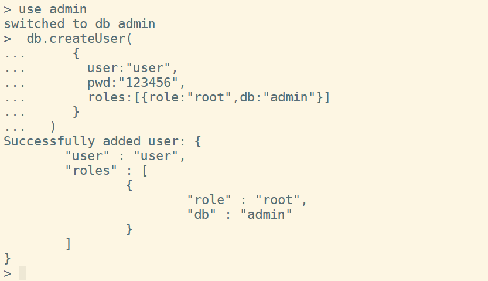
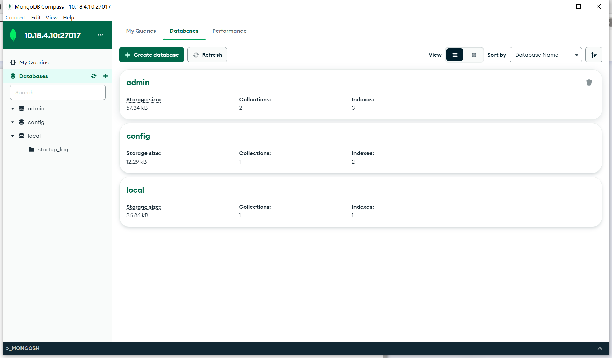

# SIT323/SIT737- Cloud Native Application Development  9.1P: Adding a database to your application 

The required tools for doing this task are as follows:

- Git (https://github.com)
  - 
- Visual Studio (https://code.visualstudio.com/)
  - 
- Node.js (https://nodejs.org/en/download/)
  - 
- Docker 
  - 
- Kubernetes // a computing platform to host your microservice 
  - 
- Kubectl // the command-line tool for interacting with Kubernetes cluster
  - 
- MongoDB
- Docker Compose 
  - 

## Instructions 

### 1.Install MongoDB into the Kubernetes cluster, either as a standalone instance or a replica set, depending on your requirements.

```yaml
# mongodb deploy yaml 
cat > mongodb-deploy.yaml <<EOF
apiVersion: apps/v1
kind: Deployment
metadata:
  name: mongodb-deploy
  namespace: default
spec:
  replicas: 1
  selector:
    matchLabels:
      app: mongodb
  template:
    metadata:
      labels:
        app: mongodb
    spec:
      containers:
        - name: mongodb
          image: mongo:5.0.9
          imagePullPolicy: IfNotPresent
          ports:
            - containerPort: 27017
EOF

#deploy mongdb 
kubectl apply -f mongodb-deploy.yaml

kubectl get deploy,pod 
```


### 2.Create a MongoDB user with appropriate permissions for your application.

```shell
#exec pod 
kubectl exec -it mongodb-deploy-74896cf8d8-7dz5k  /bin/bash

#Entering the mongdb client
mongo admin

#create a MongoDB user
> use admin
> db.createUser(
     {
       user:"user",
       pwd:"123456",
       roles:[{role:"root",db:"admin"}]
     }
  )
```




### 3.Configure persistent storage for the MongoDB database by creating a Persistent Volume and Persistent Volume Claim.

```yaml
#PV Yaml list
cat >mongodb-pv.yaml <<EOF
apiVersion: v1
kind: PersistentVolume
metadata:
  name: mongodb-pv
  namespace: default
spec:
  capacity:
    storage: 5Gi
  accessModes:
    - ReadWriteMany
  persistentVolumeReclaimPolicy: Retain
  hostPath:
    path: "/mongodb/pvc"
EOF

#PVC Yaml list
cat > mongodb-pvc.yaml <<EOF
apiVersion: v1
kind: PersistentVolumeClaim
metadata:
  name: mongodb-pvc
spec:
  volumeName: mongodb-pv
  accessModes:
    - ReadWriteOnce
  resources:
    requests:
      storage: 5Gi
EOF

#deploy
kubectl apply -f mongodb-pv.yaml
kubectl apply -f mongodb-pvc.yaml
#list
kubectl get pv,pvc
```


```yaml
#Update mongodb-deploy.yaml resource list
cat > mongodb-deploy.yaml <<EOF
apiVersion: apps/v1
kind: Deployment
metadata:
  name: mongodb-deploy
  namespace: default
spec:
  replicas: 1
  selector:
    matchLabels:
      app: mongodb
  template:
    metadata:
      labels:
        app: mongodb
    spec:
      containers:
        - name: mongodb
          image: mongo:5.0.9
          imagePullPolicy: IfNotPresent
          ports:
            - containerPort: 27017
          volumeMounts:
            - name: mongo-pvc
              mountPath: /data/db	
      volumes:
        - name: mongo-pvc
          persistentVolumeClaim:
            claimName: mongodb-pvc
EOF

#redeployment 
[root@k8s-master-node1 ~]# kubectl apply -f mongodb-deploy.yaml
deployment.apps/mongodb-deploy configured

#test pvc data
[root@k8s-master-node1 ~]# ls /mongodb/pvc/
[root@k8s-master-node1 ~]# touch /mongodb/pvc/abc
[root@k8s-master-node1 ~]# kubectl exec -it mongodb-deploy-8fd8b48df-f8dp8  /bin/bash
root@mongodb-deploy-8fd8b48df-f8dp8:/# ls /data/mongodb/
abc
```


### 4.Create a Kubernetes Secret for the MongoDB user credentials and add them to the deployment manifest.

```shell
kubectl create secret generic mongodb-user \
    --from-literal=username=user \
    --from-literal=password='123456' -oyaml --dry-run > mongodb-user-secret.yaml
```


### 5.Modify the Kubernetes deployment manifest for your application to include the newly added MongoDB database. Ensure that the configuration includes information such as the database type, credentials, and other necessary parameters.

​	① Create a configuration file for mongodb and store it in configmap 

```shell
cat > mongodb-configmap.yaml <<EOF
apiVersion: v1
kind: ConfigMap
metadata:
  name: mongodb-conf
data:
  mongodb.conf: |
        dbpath=/data/mongodb
        logpath=/data/mongodb/mongodb.log
        pidfilepath=/data/mongodb/master.pid
        directoryperdb=true
        logappend=true
        bind_ip=0.0.0.0
        port=27017
EOF
```

​	②Update resource list

```yaml
cat > mongodb-deploy.yaml <<EOF
apiVersion: apps/v1
kind: Deployment
metadata:
  name: mongodb-deploy
  namespace: default
spec:
  replicas: 1
  selector:
    matchLabels:
      app: mongodb
  template:
    metadata:
      labels:
        app: mongodb
    spec:
      containers:
      - command:
        - sh
        - -c
        - "exec mongod -f /data/mongodb/conf/mongodb.conf --auth"
        name: mongodb
        image: mongo:5.0.9
        imagePullPolicy: IfNotPresent
        #Import values using the created secret
        env:
          - name: MONGO_INITDB_ROOT_USERNAME
            valueFrom:
              secretKeyRef:
                name: mongodb-user
                key: username
          - name: MONGO_INITDB_ROOT_PASSWORD
            valueFrom:
              secretKeyRef:
                name: mongodb-user
                key: password
        ports:
          - containerPort: 27017
        volumeMounts:
          - name: mongo-pvc
            mountPath: /data/
        volumeMounts:
        - name: mongodb-config
          mountPath: /data/mongodb/conf/
        - name: mongo-pvc
          mountPath: /data/mongodb/
      volumes:
      - name: mongodb-config
        configMap:
          name: mongodb-conf
      - name: mongo-pvc
        persistentVolumeClaim:
          claimName: mongodb-pvc
EOF
```


### 6.Configure the application to connect to the MongoDB database using the MongoDB client driver library and the connection string in the deployment manifest.

​	①Create an SVC of nodeport type, mapping Mongo to port 27017 of the host

```
cat > mongodb-svc.yaml <<EOF
apiVersion: v1
kind: Service
metadata:
  name: mongodb-service
spec:
  type: NodePort
  selector:
    app: mongodb
  ports:
    - protocol: TCP
      port: 27017
      targetPort: 27017
      nodePort: 27017
EOF
```


​	②Using Visual Studio development tools to connect to Mongodb using local nodejs


​	③As shown in the following figure, using the MongDB Compass client tool can also connect successfully。




### 7.Test the deployment to ensure that the application can connect to the MongoDB database and perform basic CRUD (Create, Read, Update, Delete) operations.

①Create


②Read


​	Alternatively, use pod exec


​	The following figure shows the imported data that has been read from the test table


③Update


④Delete


⑤插入数据


### 9.Monitor the MongoDB database and application performance to ensure that the database is running smoothly and efficiently.